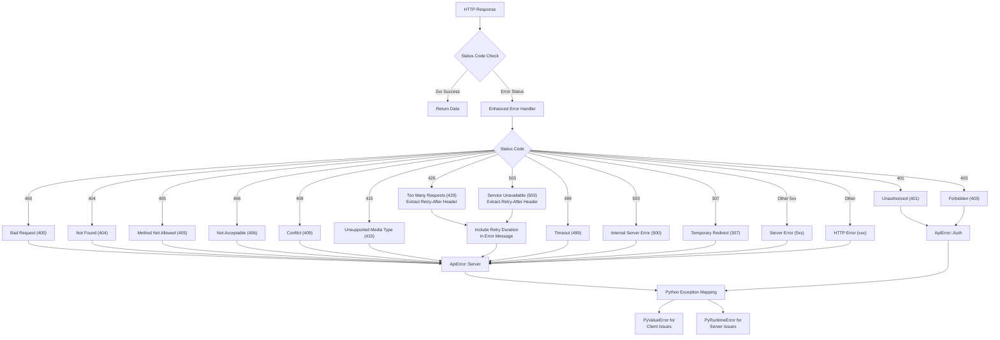

# Error Handling

## Error Handling Flow

## Handled HTTP Status Codes

| Code | Description            | Error Type       | Special Handling            |
| ---- | ---------------------- | ---------------- | --------------------------- |
| 400  | Bad Request            | ApiError::Server | Descriptive message         |
| 401  | Unauthorized           | ApiError::Auth   | Auth-specific handling      |
| 403  | Forbidden              | ApiError::Auth   | Auth-specific handling      |
| 404  | Not Found              | ApiError::Server | Document/resource not found |
| 405  | Method Not Allowed     | ApiError::Server | Operation not supported     |
| 406  | Not Acceptable         | ApiError::Server | Media type issues           |
| 409  | Conflict               | ApiError::Server | Duplicate values            |
| 415  | Unsupported Media Type | ApiError::Server | Invalid data types          |
| 429  | Too Many Requests      | ApiError::Server | Includes retry duration     |
| 499  | Timeout                | ApiError::Server | Request timeout             |
| 500  | Internal Server Error  | ApiError::Server | Server issues               |
| 503  | Service Unavailable    | ApiError::Server | Includes retry duration     |
| 307  | Temporary Redirect     | ApiError::Server | Redirect handling           |
