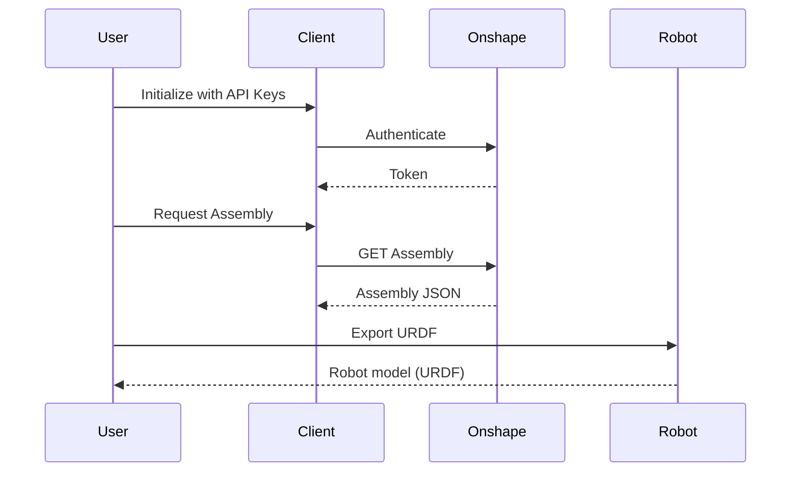

# Developer Documentation

## Architecture Overview

The library converts Onshape CAD assemblies into URDF robot models. Key components:

- **Client**: API authentication and communication
- **Robot**: Main entry point (`Robot.from_url()`), URDF export, visualization
- **CAD**: PathKey-based assembly representation with registries
- **Graph**: Kinematic graph construction from mates

## Workflow Sequence



## CAD → Robot Conversion Pipeline

### Overview

The conversion from Onshape assembly JSON to URDF robot follows these phases:

```
Assembly JSON → CAD (flattened) → KinematicGraph → Robot → URDF/MJCF
```

### Phase Breakdown

#### Phase 1: CAD Population (`CAD.from_assembly()`)

**Input**: Onshape Assembly JSON (from API)

**Output**: CAD object with flattened registries

**Operations**:

1. Build `id_to_name` mapping from all instances (root + subassemblies)
2. Build PathKey indexes from occurrences (canonical source of truth)
3. Populate flat registries: instances, occurrences, mates, patterns
4. Mark rigid assemblies based on `max_depth`
5. (Optional) Fetch nested subassemblies for flexible assemblies

**Key Point**: All data is flattened to root level with absolute PathKeys

#### Phase 2: KinematicGraph Construction (`KinematicGraph.__init__()`)

**Input**: CAD object

**Output**: NetworkX DiGraph with PathKey nodes and mate edges

**Operations**:

1. Collect mates from all sources (root + fetched subassemblies)
2. Validate PathKeys (must exist in parts or instances)
3. Build undirected graph (nodes = parts, edges = mates)
4. Remove disconnected subgraphs
5. Convert to directed graph with root detection
6. Calculate topological order

**Key Point**: All mates already use absolute PathKeys with assembly provenance baked into key structure

#### Phase 3: Lazy Parts Population

**Input**: CAD + KinematicGraph

**Output**: CAD.parts populated for kinematic parts only

**Operations**:

1. Get list of parts in kinematic graph (graph.nodes)
2. Populate CAD.parts from assembly data (no mass properties yet)
3. Async batch fetch mass properties from Onshape API
4. Update CAD.parts[key].MassProperty

**Key Point**: Parts dict initially empty, only populated for kinematic chain (optimization)

#### Phase 4: Robot Generation (`get_robot_from_kinematic_graph()`)

**Input**: CAD + KinematicGraph + Client

**Output**: Robot object with Links, Joints, Assets

**Operations**:

1. Process root node → create root Link
2. Iterate edges in topological order
3. For each edge (parent → child):
   - Get mate data from edge
   - Create Joint(s) from mate type
   - Create child Link
   - Download STL asset
   - Calculate transforms (stl_to_link_tf)
4. Handle mate relations (mimic joints)
5. Package assets and metadata

**Key Point**: Uses PathKeys to lookup parts, transforms, names

### Data Requirements from CAD Class

Based on the pipeline analysis, the CAD class must provide:

#### 1. **PathKey Infrastructure**

```python
# Dual indexing for O(1) lookup
cad.keys: dict[tuple[str, ...], PathKey]           # ID path → PathKey
cad.keys_by_name: dict[tuple[str, ...], PathKey]   # Name path → PathKey

# PathKey utilities
cad.get_path_key(path: str | list[str]) -> PathKey | None
cad.get_path_key_by_name(name: str | list[str]) -> PathKey | None
```

**Used by**: All phases for entity identification

#### 2. **Instance Registry**

```python
cad.instances: dict[PathKey, PartInstance | AssemblyInstance]

# Query methods
cad.is_part(key: PathKey) -> bool
cad.is_rigid_assembly(key: PathKey) -> bool
cad.is_flexible_assembly(key: PathKey) -> bool
```

**Used by**:

- KinematicGraph: Validate mate targets, check rigid assemblies
- Robot: Get instance names for link/joint naming

#### 3. **Occurrence Registry (Transforms)**

```python
cad.occurrences: dict[PathKey, Occurrence]

# Query methods
cad.get_transform(key: PathKey) -> np.ndarray | None  # 4x4 matrix
```

**Used by**:

- KinematicGraph: Check if part is fixed (user-defined root)
- Robot: Get world transforms for pattern expansion
- (Future) Hierarchical transforms for rigid subassemblies

#### 4. **Mate Registry**

```python
# Mate key: (assembly_key, parent_key, child_key)
# assembly_key is None for root assembly, PathKey for subassembly
cad.mates: dict[tuple[Optional[PathKey], PathKey, PathKey], MateFeatureData]

# Query methods
cad.get_mates_from_root() -> dict[tuple[PathKey, PathKey], MateFeatureData]
cad.get_all_mates_flattened() -> dict[tuple[PathKey, PathKey], MateFeatureData]
cad.get_mate_data(parent: PathKey, child: PathKey, assembly: Optional[PathKey] = None)
cad.get_mate_assembly(parent: PathKey, child: PathKey) -> Optional[PathKey]
```

**Used by**:

- KinematicGraph: Build graph edges, collect from subassemblies
- Robot: Get joint type, coordinate systems

**Key Design**: Assembly provenance baked into mate key instead of separate structure

#### 5. **Parts Registry (Metadata + Mass)**

```python
cad.parts: dict[PathKey, Part]  # Initially empty - lazy population

# Part fields required:
# - documentId, elementId, documentMicroversion, partId
# - configuration, fullConfiguration
# - isRigidAssembly (bool)
# - rigidAssemblyWorkspaceId (for STL downloads)
# - MassProperty (populated later, may be None)

# Population method
cad.populate_parts_for_keys(keys: set[PathKey], assembly: Assembly) -> None
```

**Used by**:

- KinematicGraph: Validate nodes, add part metadata to graph
- Robot: Get mass properties, download STLs, workspace IDs

**Population Strategy**:

- Initially empty dict (optimization)
- Populated after graph construction for kinematic parts only
- Includes rigid assemblies (marked with `isRigidAssembly=True`)
- Mass properties fetched separately in Phase 3

#### 6. **Pattern Registry**

```python
cad.patterns: dict[str, Pattern]

# Query methods
cad.get_pattern_for_seed(seed_id: str) -> Pattern | None
cad.get_patterned_instances(seed_id: str) -> list[str]
```

**Used by**: (Future) Mate processing for pattern expansion

#### 7. **Fetched Subassemblies**

```python
# For recursively fetched flexible assemblies (external documents)
cad.fetched_subassemblies: dict[PathKey, CAD]
```

**Used by**: KinematicGraph (collect mates from recursively fetched assemblies)

**Note**: All subassembly data is flattened into root registries during population

#### 8. **Document Metadata**

```python
cad.document_id: str
cad.element_id: str
cad.workspace_id: str
cad.document_microversion: str
cad.max_depth: int
cad.current_depth: int
```

**Used by**: Robot (workspace ID for STL downloads)

### Critical Design Requirements

#### Requirement 1: Flat Storage, Absolute PathKeys

**Rationale**: Simplifies lookups, avoids nested traversal

```python
# ✅ Good: Single lookup
instance = cad.instances[key]

# ❌ Bad: Nested traversal
instance = cad.root_assembly.instances[key] or \
           cad.sub_assemblies[sub_key].instances[rel_key]
```

#### Requirement 2: Lazy Parts Population

**Rationale**: Avoid expensive data processing for non-kinematic parts

```python
# Phase 1: Parts dict initially empty
cad.parts = {}

# Phase 3: Populate ONLY for kinematic parts
cad.populate_parts_for_keys(kinematic_graph.graph.nodes, assembly)
fetch_mass_properties_for_kinematic_parts(cad, kinematic_graph, client)
```

#### Requirement 3: Mate Assembly Provenance

**Rationale**: Track which assembly owns each mate without separate class

```python
# Mate key encodes assembly provenance
(None, parent_key, child_key)  # Root assembly mate
(sub_key, parent_key, child_key)  # Subassembly mate
```

#### Requirement 4: Rigid Assembly Handling

**Rationale**: Support assemblies treated as single rigid bodies

```python
# Parts registry includes rigid assemblies
cad.parts[rigid_key] = Part(
    isRigidAssembly=True,
    rigidAssemblyWorkspaceId=...,
    ...
)

# Instances registry tracks rigid flag
cad.instances[rigid_key] = AssemblyInstance(isRigid=True)

# Mates filtered/remapped during graph construction
if parent_rigid == child_rigid:
    # Filter internal mate
elif parent_rigid:
    # Remap to rigid root
```

#### Requirement 5: Name Consistency

**Rationale**: Names must match between PathKeys, instances, and URDF output

```python
# PathKey name matches sanitized instance name
key.name == get_sanitized_name(instance.name)

# Hierarchical names for URDF
link_name = key.hierarchical_name(separator="-")
# "assembly_1-subassembly_2-part_3"
```

### Data Flow Summary

```
Assembly JSON
    ↓
CAD.from_assembly()
    ↓
CAD (flat registries with absolute PathKeys)
    ├─ keys, keys_by_name
    ├─ instances (all parts + assemblies)
    ├─ occurrences (transforms)
    ├─ mates (with assembly provenance in key)
    ├─ patterns
    ├─ parts (initially empty)
    └─ fetched_subassemblies (external documents)
    ↓
KinematicGraph(cad)
    ├─ Collect mates from root + fetched subassemblies
    ├─ Validate PathKeys (must exist in instances)
    ├─ Build graph (nodes=PathKeys, edges=mates)
    └─ Detect root, topological order
    ↓
cad.populate_parts_for_keys(graph.nodes, assembly)
    └─ Populate cad.parts for kinematic chain only
    ↓
fetch_mass_properties_for_kinematic_parts(cad, graph)
    └─ Add MassProperty to cad.parts[key] for graph nodes
    ↓
get_robot_from_kinematic_graph(cad, graph, client)
    ├─ Root link: cad.parts[root_key], cad.instances[root_key]
    ├─ For each edge:
    │   ├─ Get parts: cad.parts[parent_key], cad.parts[child_key]
    │   ├─ Get mate: graph.get_mate_data(parent, child)
    │   ├─ Get names: cad.instances[key].name
    │   └─ Download STL: part.documentId, part.partId
    └─ Create Robot object
    ↓
Robot.save()
    └─ Export URDF/MJCF + STL assets
```

## Transform System

### Entity Order Convention

```python
CHILD = 0   # Entity that moves to parent's location
PARENT = 1  # Fixed reference entity
```

### Key Transform Matrices

| Matrix             | Description                                             |
| ------------------ | ------------------------------------------------------- |
| `part_to_mate_tf`  | Part → Mate coordinate system (fundamental transform)   |
| `parentCS.part_tf` | Hierarchical transform for parts in rigid subassemblies |
| `_stl_to_link_tf`  | STL → Link coordinates (inverse for mesh positioning)   |

### Link Transforms

**Root Link:** Uses center of mass as origin

```python
_link_to_stl_tf[:3, 3] = part.MassProperty.center_of_mass
```

**Child Links:**

```python
# Regular parts
_link_to_stl_tf = mate.matedEntities[CHILD].matedCS.part_to_mate_tf

# Parts in rigid subassemblies (with hierarchical transform)
_link_to_stl_tf = (
    mate.matedEntities[CHILD].parentCS.part_tf @
    mate.matedEntities[CHILD].matedCS.part_to_mate_tf
)
```

### Joint Transforms

```python
# Regular assemblies
parent_to_mate_tf = mate.matedEntities[PARENT].matedCS.part_to_mate_tf

# Rigid assemblies (hierarchical)
parent_to_mate_tf = (
    mate.matedEntities[PARENT].parentCS.part_tf @
    mate.matedEntities[PARENT].matedCS.part_to_mate_tf
)

# Final joint origin
stl_to_mate_tf = stl_to_parent_tf @ parent_to_mate_tf
```

## Assembly Pattern Support

### Pattern Transform Calculation

Patterns create multiple instances. Transforms preserve relative positioning:

```python
# Calculate relative transform seed → pattern
seed_to_pattern_relative_tf = pattern_tf @ np.linalg.inv(seed_tf)

# Transform pipeline: local → world → pattern_relative → local
other_mate_world_tf = other_entity_tf @ original_mate_cs.part_to_mate_tf
pattern_world_tf = seed_to_pattern_relative_tf @ other_mate_world_tf
final_mate_cs = np.linalg.inv(other_entity_tf) @ pattern_world_tf

# Floating point cleanup
final_mate_cs[np.abs(final_mate_cs) < 1e-10] = 0.0
```

## Hierarchical Rigid Subassembly Support

### Transform Chain Building

Build cumulative transform from rigid subassembly root to deeply nested part:

```python
def build_hierarchical_transform_for_rigid_subassembly(
    occurrences_list: list[str],  # [rigid_sub, level1, level2, part]
    rigid_subassembly_occurrence_map: dict[str, dict[str, Occurrence]],
) -> np.matrix:
    parent_tf = np.eye(4)

    # Build hierarchical keys, excluding rigid subassembly root
    for i in range(len(occurrences_list) - 1):
        key = SUBASSEMBLY_JOINER.join(occurrences_list[1:i+2])
        occurrence_tf = rigid_subassembly_occurrences[key].transform
        parent_tf = parent_tf @ occurrence_tf

    return parent_tf
```

### Hierarchical Key Structure

| Assembly Structure            | Global Key                              | Rigid Subassembly Key  |
| ----------------------------- | --------------------------------------- | ---------------------- |
| `[rigid_sub, level1]`         | `rigid_sub_JOINER_level1`               | `level1`               |
| `[rigid_sub, level1, level2]` | `rigid_sub_JOINER_level1_JOINER_level2` | `level1_JOINER_level2` |

## Disconnected Graph Resolution

At shallow `max_depth`, mates may reference parts inside rigid subassemblies that aren't individually accessible.

### Instance Proxy Mapping

```python
instance_proxy_map = {
    "wheel_subassembly_JOINER_hub": "wheel_subassembly",
    "wheel_subassembly_JOINER_roller_1": "wheel_subassembly",
}
```

### Proxy-Aware Functions

```python
def join_mate_occurrences_with_proxy(
    parent_occurrences, child_occurrences,
    instance_proxy_map, subassembly_prefix=None
) -> str:
    parent = get_proxy_occurrence_name(parent_occurrences, instance_proxy_map, subassembly_prefix)
    child = get_proxy_occurrence_name(child_occurrences, instance_proxy_map, subassembly_prefix)
    return f"{parent}{MATE_JOINER}{child}"
```

### Unique Mate Names

Iteratively resolve naming conflicts from pattern expansion:

```python
def ensure_unique_mate_names(mates: dict[str, MateFeatureData]) -> None:
    max_iterations = 10
    for iteration in range(max_iterations):
        name_counts = Counter(mate.featureData.name for mate in mates.values())
        # Resolve conflicts with numeric suffixes
```

## Mixed Flexible-Rigid Assembly Support

At `max_depth=1`, flexible assemblies use sanitized names while rigid subassemblies use prefixed keys.

### Sanitized → Prefixed Mapping

```python
rigid_subassembly_sanitized_to_prefixed = {
    'double-wheel_1': 'wheel_1_78C6_double-wheel_1',
    'single-wheel_1': 'wheel_1_78C6_double-wheel_1_78C6_single-wheel_1',
}

# Use for detection
if parent_occurrences[0] in rigid_subassembly_sanitized_to_prefixed:
    prefixed_name = rigid_subassembly_sanitized_to_prefixed[parent_occurrences[0]]
    # Apply hierarchical transforms with prefixed name
```

## CAD Class and PathKey System

### Data Structure (Flat Design)

```python
# All data stored in flat registries with absolute PathKeys
cad.keys: dict[tuple[str, ...], PathKey]
cad.keys_by_name: dict[tuple[str, ...], PathKey]
cad.instances: dict[PathKey, PartInstance | AssemblyInstance]
cad.occurrences: dict[PathKey, Occurrence]
cad.mates: dict[tuple[Optional[PathKey], PathKey, PathKey], MateFeatureData]
cad.patterns: dict[str, Pattern]
cad.parts: dict[PathKey, Part]  # Lazy - populated after graph construction
cad.fetched_subassemblies: dict[PathKey, CAD]  # External documents only
```

### PathKey Creation

```python
# PathKey requires both ID path and name path
id_to_name = {"MqRDHdbA0tAm2ygBR": "test_part", ...}
key = PathKey.from_path("MqRDHdbA0tAm2ygBR", id_to_name)
# Or directly: PathKey(("MqRDHdbA0tAm2ygBR",), ("test_part",))

# Access
instance = cad.instances[key]
occurrence = cad.occurrences[key]
part = cad.parts[key]  # Only after populate_parts_for_keys()
```

### Rigid Assembly Detection

```python
# ✅ Correct: Use helper methods
if cad.is_rigid_assembly(key):
    # Handle rigid assembly

# Mark during population
if key.depth > max_depth:
    instance.isRigid = True
```

### Rigid Mate Remapping Example

**Before:**

```python
parent_key = PathKey(('rigid_sub', 'level1', 'buried_part'))  # depth=3
```

**After:**

```python
parent_key = PathKey(('rigid_sub', 'level1'))  # Remapped to rigid root (depth=2)
mate.matedEntities[PARENT].matedCS = hierarchical_tf @ original_matedCS
mate.matedEntities[PARENT].matedOccurrence = ['rigid_sub', 'level1']
```

### Hierarchical Transform with PathKeys

```python
def _build_hierarchical_transform(part_key, rigid_root_key, occurrence_registry):
    """Build transform from rigid root to buried part using PathKey."""
    parent_tf = np.eye(4)
    rigid_depth = len(rigid_root_key.path)

    for i in range(rigid_depth, len(part_key.path)):
        level_key = PathKey(part_key.path[:i+1])
        level_tf = occurrence_registry.get_transform(level_key)
        if level_tf is not None:
            parent_tf = parent_tf @ level_tf

    return np.matrix(parent_tf) if not np.allclose(parent_tf, np.eye(4)) else None
```

### Pattern Expansion with PathKeys

```python
# Find pattern instance by leaf_id
pattern_key = _find_instance_key_by_leaf_id(pattern_instance_id, instances)

# Get transforms
seed_tf = occurrence_registry.get_transform(seed_key)
pattern_tf = occurrence_registry.get_transform(pattern_key)

# Calculate and apply
seed_to_pattern_tf = pattern_tf @ np.linalg.inv(seed_tf)
new_mate_tf = seed_to_pattern_tf @ (other_tf @ original_mate_cs)
```

### Internal Mate Filtering

```python
# Remove mates completely within same rigid subassembly
if parent_rigid_root == child_rigid_root:
    del mate_registry.mates[(parent_key, child_key)]
```

## CAD Population: CAD.from_assembly()

**Operations**:

1. Build `id_to_name` mapping from all instances in assembly JSON
2. Create PathKey indexes from occurrences (dual indexing: ID and name)
3. Populate flat registries:
   - `_populate_instances()`: All parts and assemblies from occurrences
   - `_populate_occurrences()`: All occurrence transforms
   - `_populate_mates()`: Mates with assembly provenance in key
   - `_populate_patterns()`: Assembly patterns
   - `_mark_rigid_assemblies()`: Flag assemblies beyond max_depth
4. Parts dict remains empty (lazy population after graph construction)
5. Optionally fetch external subassemblies (different documents)

## KinematicGraph: Graph Construction from CAD

The `KinematicGraph` class builds a directed graph from CAD assembly data where nodes are parts (PathKeys) and edges are mate relationships.

### Basic Usage

```python
from onshape_robotics_toolkit.graph import KinematicGraph

# Create tree from CAD document
tree = KinematicGraph(cad_doc, use_user_defined_root=True)

# Access graph structure
graph = tree.graph  # NetworkX DiGraph
root = tree.root_node  # PathKey of root part
order = tree.topological_order  # Tuple of PathKeys from root to leaves

# Navigate tree
children = tree.get_children(part_key)
parent = tree.get_parent(part_key)
mate_data = tree.get_mate_data(parent_key, child_key)
```

### PathKey Comparison Operators

**Requirement**: PathKey must implement comparison operators for graph algorithms (sorting, visualization).

```python
class PathKey:
    def __lt__(self, other: "PathKey") -> bool:
        """Sort by depth first (shallower first), then lexicographically."""
        return (self.depth, self._path) < (other.depth, other._path)

    def __le__(self, other: "PathKey") -> bool:
        return (self.depth, self._path) <= (other.depth, other._path)

    def __gt__(self, other: "PathKey") -> bool:
        return (self.depth, self._path) > (other.depth, other._path)

    def __ge__(self, other: "PathKey") -> bool:
        return (self.depth, self._path) >= (other.depth, other._path)
```

### Mate Collection

Mates are stored with assembly provenance baked into the key structure:

```python
def _collect_all_mates(self) -> dict[tuple[PathKey, PathKey], MateFeatureData]:
    """Collect mates from root and fetched subassemblies."""
    # Get flattened mates (strips assembly provenance)
    all_mates = self.cad.get_all_mates_flattened()

    # Add mates from recursively fetched subassemblies
    for fetched_cad in self.cad.fetched_subassemblies.values():
        fetched_mates = fetched_cad.get_all_mates_flattened()
        all_mates.update(fetched_mates)

    return all_mates
```

**Key Simplification**: All PathKeys are absolute, assembly provenance tracked in mate key structure `(assembly_key, parent_key, child_key)`

### Debugging Disconnected Graphs

**Common Causes**:

1. Mates referencing invalid PathKeys (not in instances registry)
2. Parts not meeting validation criteria (`_is_valid_mate_target()`)

**Debugging Steps**:

```python
# Check component count
import networkx as nx
components = list(nx.connected_components(tree.graph.to_undirected()))
print(f"Components: {len(components)}")

# Inspect mate structure
for (parent, child), mate in tree._collect_all_mates().items():
    print(f"{parent} <-> {child}")
    valid_parent = tree._is_valid_mate_target(parent)
    valid_child = tree._is_valid_mate_target(child)
    print(f"  Valid: parent={valid_parent}, child={valid_child}")
```

## Robot Creation from KinematicGraph

### Workflow

```python
from onshape_robotics_toolkit.parse import CAD, fetch_mass_properties_for_kinematic_parts
from onshape_robotics_toolkit.graph import KinematicGraph
from onshape_robotics_toolkit.robot import get_robot_from_kinematic_graph

# 1. Create CAD structure (flat registries, parts dict initially empty)
cad = CAD.from_assembly(assembly, max_depth=1)

# 2. Build kinematic graph
kinematic_graph = KinematicGraph(cad=cad, use_user_defined_root=True)

# 3. Lazy populate parts for kinematic chain only
cad.populate_parts_for_keys(kinematic_graph.graph.nodes, assembly)

# 4. Fetch mass properties (selective for efficiency)
fetch_mass_properties_for_kinematic_parts(cad, kinematic_graph, client)

# 5. Generate robot structure
robot = get_robot_from_kinematic_graph(cad, kinematic_graph, client, "my_robot")

# 6. Save URDF with assets
robot.save("robot.urdf", download_assets=True)
```

### Mass Property Fetching

**Selective fetching** only retrieves mass properties for parts in the kinematic chain:

```python
async def _fetch_mass_properties_for_pathkeys_async(
    cad: CAD,
    part_keys: list[PathKey],
    client: Client
) -> None:
    tasks = []
    for key in part_keys:
        part = cad.parts[key]
        if part.MassProperty is not None:
            continue  # Skip if already fetched

        # Use asyncio.to_thread for concurrent API calls
        task = asyncio.to_thread(
            client.get_mass_property,
            did=part.documentId,
            wtype=WorkspaceType.M.value,
            wid=part.documentMicroversion or cad.document_microversion,
            eid=part.elementId,
            partID=part.partId,
        )
        tasks.append((key, task))

    # Execute concurrently
    results = await asyncio.gather(*[task for _, task in tasks], return_exceptions=True)
```

### Graph Edge Data Preservation

**Critical**: `nx.bfs_tree()` creates trees without edge data. Must restore mate data after BFS:

```python
def convert_to_digraph(graph: nx.Graph, user_defined_root: Any = None) -> tuple[nx.DiGraph, Any]:
    # BFS tree loses edge data!
    bfs_graph = nx.bfs_tree(graph, root_node)
    di_graph = nx.DiGraph(bfs_graph)

    # Restore edge data for BFS tree edges
    for u, v in list(di_graph.edges()):
        if graph.has_edge(u, v):
            di_graph[u][v].update(graph[u][v])
        elif graph.has_edge(v, u):
            di_graph[u][v].update(graph[v][u])

    return di_graph, root_node
```

### Asset Download: Workspace Types

Different entity types require different workspace types for STL downloads:

```python
# Regular parts: Use microversion type
if not part.isRigidAssembly:
    wtype = WorkspaceType.M.value
    wid = part.documentMicroversion or cad.document_microversion

# Rigid assemblies: Use workspace type
elif part.isRigidAssembly:
    wtype = WorkspaceType.W.value  # Assembly STL API requires workspace type
    wid = part.rigidAssemblyWorkspaceId or cad.document_microversion

# Versioned parts: Use version type
elif part.documentVersion:
    wtype = WorkspaceType.V.value
    wid = part.documentVersion
```

**API Endpoints**:

- Parts: `/api/parts/d/{did}/m/{microversion}/e/{eid}/partid/{partId}/stl`
- Assemblies: `/api/assemblies/d/{did}/w/{workspace}/e/{eid}/translations`

### Rigid Assembly Part Creation

**SubAssembly vs AssemblyInstance**:

- `SubAssembly`: Assembly definition (where it's defined in Onshape)
- `AssemblyInstance`: Insertion point (where instance was created)

For rigid assemblies, use **SubAssembly data** for Part creation:

```python
# Find matching SubAssembly for the AssemblyInstance
for subassembly in assembly.subAssemblies:
    if subassembly.elementId == assembly_instance.elementId:
        matching_subassembly = subassembly
        break

# Use SubAssembly's document info (NOT instance's)
self.parts[key] = Part(
    documentId=matching_subassembly.documentId,
    elementId=matching_subassembly.elementId,
    documentMicroversion=matching_subassembly.documentMicroversion,
    isRigidAssembly=True,
    rigidAssemblyWorkspaceId=matching_subassembly.documentMicroversion,  # Workspace ID for STL download
    ...
)
```

**Note**: `SubAssembly` lacks `documentMetaData`, so we use `documentMicroversion` as workspace ID. This works for same-document assemblies but may fail for cross-document references.

## Key Conventions

- **Link Origins**: Always at zero vector after transformation
- **Joint Origins**: At mate coordinate system locations
- **Mesh Positioning**: STL files transformed to link coordinate systems
- **Internal Mates**: Removed if both entities within same rigid assembly
- **Pattern Transforms**: Applied in world space, converted to local coordinates
- **Floating Point**: Clean values < 1e-10 to zero
- **PathKey Comparison**: Required for graph sorting, compares depth then path lexicographically
- **Subassembly Mates**: Always stored as relative PathKeys, must convert to absolute before use
- **Rigid Assembly Mates**: Filter internal, remap cross-boundary to rigid root
- **Edge Data in Graphs**: `nx.bfs_tree()` loses edge attributes, must restore mate_data manually
- **Mass Properties**: Fetch selectively for kinematic chain parts only, use `asyncio.to_thread()` for concurrency
- **Workspace Types**: Parts use microversion ('m'), assemblies use workspace ('w'), versions use version ('v')
