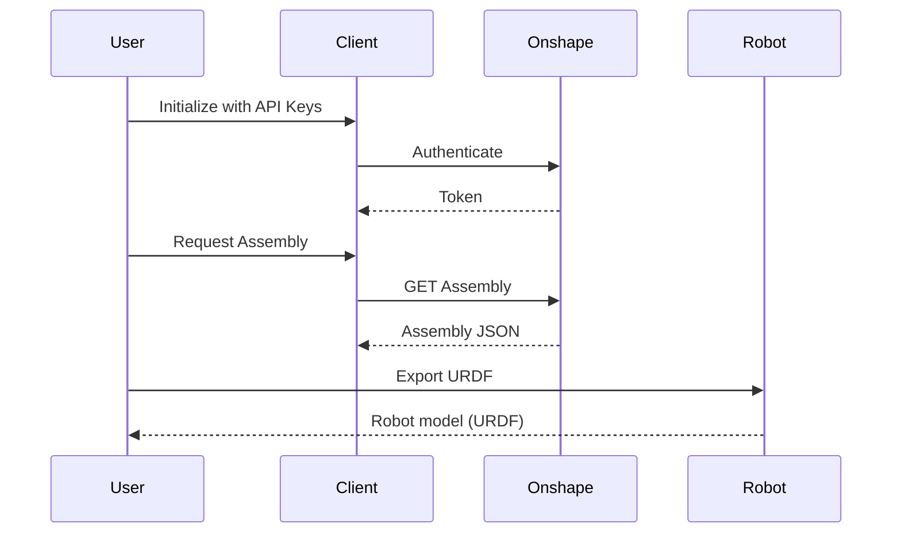

# Developer Documentation

## Architecture Overview

The library converts Onshape CAD assemblies into URDF robot models. Key components:

- **Client**: API authentication and communication
- **Robot**: Main entry point (`Robot.from_url()`), URDF export, visualization
- **CAD**: PathKey-based assembly representation with registries
- **Graph**: Kinematic graph construction from mates

## Workflow Sequence



## Transform System

### Entity Order Convention

```python
CHILD = 0   # Entity that moves to parent's location
PARENT = 1  # Fixed reference entity
```

### Key Transform Matrices

| Matrix             | Description                                             |
| ------------------ | ------------------------------------------------------- |
| `part_to_mate_tf`  | Part → Mate coordinate system (fundamental transform)   |
| `parentCS.part_tf` | Hierarchical transform for parts in rigid subassemblies |
| `_stl_to_link_tf`  | STL → Link coordinates (inverse for mesh positioning)   |

### Link Transforms

**Root Link:** Uses center of mass as origin

```python
_link_to_stl_tf[:3, 3] = part.MassProperty.center_of_mass
```

**Child Links:**

```python
# Regular parts
_link_to_stl_tf = mate.matedEntities[CHILD].matedCS.part_to_mate_tf

# Parts in rigid subassemblies (with hierarchical transform)
_link_to_stl_tf = (
    mate.matedEntities[CHILD].parentCS.part_tf @
    mate.matedEntities[CHILD].matedCS.part_to_mate_tf
)
```

### Joint Transforms

```python
# Regular assemblies
parent_to_mate_tf = mate.matedEntities[PARENT].matedCS.part_to_mate_tf

# Rigid assemblies (hierarchical)
parent_to_mate_tf = (
    mate.matedEntities[PARENT].parentCS.part_tf @
    mate.matedEntities[PARENT].matedCS.part_to_mate_tf
)

# Final joint origin
stl_to_mate_tf = stl_to_parent_tf @ parent_to_mate_tf
```

## Assembly Pattern Support

### Pattern Transform Calculation

Patterns create multiple instances. Transforms preserve relative positioning:

```python
# Calculate relative transform seed → pattern
seed_to_pattern_relative_tf = pattern_tf @ np.linalg.inv(seed_tf)

# Transform pipeline: local → world → pattern_relative → local
other_mate_world_tf = other_entity_tf @ original_mate_cs.part_to_mate_tf
pattern_world_tf = seed_to_pattern_relative_tf @ other_mate_world_tf
final_mate_cs = np.linalg.inv(other_entity_tf) @ pattern_world_tf

# Floating point cleanup
final_mate_cs[np.abs(final_mate_cs) < 1e-10] = 0.0
```

## Hierarchical Rigid Subassembly Support

### Transform Chain Building

Build cumulative transform from rigid subassembly root to deeply nested part:

```python
def build_hierarchical_transform_for_rigid_subassembly(
    occurrences_list: list[str],  # [rigid_sub, level1, level2, part]
    rigid_subassembly_occurrence_map: dict[str, dict[str, Occurrence]],
) -> np.matrix:
    parent_tf = np.eye(4)

    # Build hierarchical keys, excluding rigid subassembly root
    for i in range(len(occurrences_list) - 1):
        key = SUBASSEMBLY_JOINER.join(occurrences_list[1:i+2])
        occurrence_tf = rigid_subassembly_occurrences[key].transform
        parent_tf = parent_tf @ occurrence_tf

    return parent_tf
```

### Hierarchical Key Structure

| Assembly Structure            | Global Key                              | Rigid Subassembly Key  |
| ----------------------------- | --------------------------------------- | ---------------------- |
| `[rigid_sub, level1]`         | `rigid_sub_JOINER_level1`               | `level1`               |
| `[rigid_sub, level1, level2]` | `rigid_sub_JOINER_level1_JOINER_level2` | `level1_JOINER_level2` |

## Disconnected Graph Resolution

At shallow `max_depth`, mates may reference parts inside rigid subassemblies that aren't individually accessible.

### Instance Proxy Mapping

```python
instance_proxy_map = {
    "wheel_subassembly_JOINER_hub": "wheel_subassembly",
    "wheel_subassembly_JOINER_roller_1": "wheel_subassembly",
}
```

### Proxy-Aware Functions

```python
def join_mate_occurrences_with_proxy(
    parent_occurrences, child_occurrences,
    instance_proxy_map, subassembly_prefix=None
) -> str:
    parent = get_proxy_occurrence_name(parent_occurrences, instance_proxy_map, subassembly_prefix)
    child = get_proxy_occurrence_name(child_occurrences, instance_proxy_map, subassembly_prefix)
    return f"{parent}{MATE_JOINER}{child}"
```

### Unique Mate Names

Iteratively resolve naming conflicts from pattern expansion:

```python
def ensure_unique_mate_names(mates: dict[str, MateFeatureData]) -> None:
    max_iterations = 10
    for iteration in range(max_iterations):
        name_counts = Counter(mate.featureData.name for mate in mates.values())
        # Resolve conflicts with numeric suffixes
```

## Mixed Flexible-Rigid Assembly Support

At `max_depth=1`, flexible assemblies use sanitized names while rigid subassemblies use prefixed keys.

### Sanitized → Prefixed Mapping

```python
rigid_subassembly_sanitized_to_prefixed = {
    'double-wheel_1': 'wheel_1_78C6_double-wheel_1',
    'single-wheel_1': 'wheel_1_78C6_double-wheel_1_78C6_single-wheel_1',
}

# Use for detection
if parent_occurrences[0] in rigid_subassembly_sanitized_to_prefixed:
    prefixed_name = rigid_subassembly_sanitized_to_prefixed[parent_occurrences[0]]
    # Apply hierarchical transforms with prefixed name
```

## CAD Class and PathKey System

### Data Structure

```python
cad.root_assembly.instances  # Flat registry: all instances
cad.sub_assemblies           # Hierarchical: dict[PathKey, AssemblyData]
cad.parts                    # Flat registry: dict[PathKey, Part]
```

### PathKey Indexing

```python
# PathKey examples
root_part = PathKey(('M0cLO6yVimMv6KhRM',))
nested_part = PathKey(('McQ65EsxX+4zImFWp', 'MUgiNm7M17UkTi3/g'))

# Access
instance = cad.root_assembly.instances.parts[key]
occurrence = cad.root_assembly.occurrences.occurrences[key]
```

### Rigid Assembly Detection

```python
# ✅ Correct: Use isRigid flag
if cad.root_assembly.instances.is_rigid_assembly(key):
    # Handle rigid assembly

# ❌ Avoid: Direct depth comparison (only for SETTING flag during population)
if key.depth > max_depth:
    instance.isRigid = True
```

### Mate Processing Pipeline

```python
cad = CAD.from_assembly(assembly, max_depth=1)
cad.process_mates_and_relations()
```

**Steps:**

1. **Filter and Remap**: Remove internal mates, remap buried parts to rigid roots, apply hierarchical transforms
2. **Expand Patterns**: Create mates for pattern instances with proper transforms
3. **Ensure Uniqueness**: Deduplicate by ID and rename for URDF compliance

### Rigid Mate Remapping Example

**Before:**

```python
parent_key = PathKey(('rigid_sub', 'level1', 'buried_part'))  # depth=3
```

**After:**

```python
parent_key = PathKey(('rigid_sub', 'level1'))  # Remapped to rigid root (depth=2)
mate.matedEntities[PARENT].matedCS = hierarchical_tf @ original_matedCS
mate.matedEntities[PARENT].matedOccurrence = ['rigid_sub', 'level1']
```

### Hierarchical Transform with PathKeys

```python
def _build_hierarchical_transform(part_key, rigid_root_key, occurrence_registry):
    """Build transform from rigid root to buried part using PathKey."""
    parent_tf = np.eye(4)
    rigid_depth = len(rigid_root_key.path)

    for i in range(rigid_depth, len(part_key.path)):
        level_key = PathKey(part_key.path[:i+1])
        level_tf = occurrence_registry.get_transform(level_key)
        if level_tf is not None:
            parent_tf = parent_tf @ level_tf

    return np.matrix(parent_tf) if not np.allclose(parent_tf, np.eye(4)) else None
```

### Pattern Expansion with PathKeys

```python
# Find pattern instance by leaf_id
pattern_key = _find_instance_key_by_leaf_id(pattern_instance_id, instances)

# Get transforms
seed_tf = occurrence_registry.get_transform(seed_key)
pattern_tf = occurrence_registry.get_transform(pattern_key)

# Calculate and apply
seed_to_pattern_tf = pattern_tf @ np.linalg.inv(seed_tf)
new_mate_tf = seed_to_pattern_tf @ (other_tf @ original_mate_cs)
```

### Internal Mate Filtering

```python
# Remove mates completely within same rigid subassembly
if parent_rigid_root == child_rigid_root:
    del mate_registry.mates[(parent_key, child_key)]
```

## Data Flow: CAD.from_assembly()

1. **Create root assembly** - Populate from `rootAssembly` JSON
2. **Populate subassemblies** - Add instances to both root (flat) and subassembly (hierarchical) registries, mark rigid assemblies by depth
3. **Populate parts** - Create Part objects for regular parts and rigid subassemblies (`isRigidAssembly=True`)

## Instance Storage Strategy

| Registry                        | Contains                           | Purpose                     |
| ------------------------------- | ---------------------------------- | --------------------------- |
| `root_assembly.instances`       | All instances (parts + assemblies) | Fast flat lookup by PathKey |
| `sub_assemblies[key].instances` | Instances within subassembly       | Preserves hierarchy         |

Mates and patterns are exclusive to subassemblies (not duplicated in root).

## KinematicGraph: Graph Construction from CAD

The `KinematicGraph` class builds a directed graph from CAD assembly data where nodes are parts (PathKeys) and edges are mate relationships.

### Basic Usage

```python
from onshape_robotics_toolkit.graph import KinematicGraph

# Create tree from CAD document
tree = KinematicGraph(cad_doc, use_user_defined_root=True)

# Access graph structure
graph = tree.graph  # NetworkX DiGraph
root = tree.root_node  # PathKey of root part
order = tree.topological_order  # Tuple of PathKeys from root to leaves

# Navigate tree
children = tree.get_children(part_key)
parent = tree.get_parent(part_key)
mate_data = tree.get_mate_data(parent_key, child_key)
```

### PathKey Comparison Operators

**Requirement**: PathKey must implement comparison operators for graph algorithms (sorting, visualization).

```python
class PathKey:
    def __lt__(self, other: "PathKey") -> bool:
        """Sort by depth first (shallower first), then lexicographically."""
        return (self.depth, self._path) < (other.depth, other._path)

    def __le__(self, other: "PathKey") -> bool:
        return (self.depth, self._path) <= (other.depth, other._path)

    def __gt__(self, other: "PathKey") -> bool:
        return (self.depth, self._path) > (other.depth, other._path)

    def __ge__(self, other: "PathKey") -> bool:
        return (self.depth, self._path) >= (other.depth, other._path)
```

### Mate Collection from Subassemblies

Mates are stored in multiple locations:

- `cad.root_assembly.mates` - Root-level mates
- `cad.sub_assemblies[key].mates` - Subassembly-specific mates
- `cad.fetched_subassemblies[key].mates` - Downloaded subassembly mates

**Critical**: Subassembly mates use **relative PathKeys** (just leaf IDs), must convert to absolute.

```python
def _collect_all_mates(self) -> dict[tuple[PathKey, PathKey], MateFeatureData]:
    """Collect mates from all sources and convert to absolute PathKeys."""
    all_mates = {}

    # Root mates (already absolute)
    all_mates.update(self.cad.root_assembly.mates.mates)

    # Subassembly mates (need conversion)
    for sub_key, sub_assembly in self.cad.sub_assemblies.items():
        converted = self._convert_subassembly_mates_to_absolute(
            sub_assembly.mates.mates, sub_key
        )
        all_mates.update(converted)

    return all_mates
```

### Rigid Assembly Mate Handling

**Problem**: Mates may reference parts inside rigid assemblies, creating disconnected graph components.

**Solution**: Two-phase processing:

1. **Filter internal mates** - Remove mates where both entities are inside the same rigid assembly
2. **Remap cross-boundary mates** - Replace buried part references with rigid assembly root

```python
def _convert_subassembly_mates_to_absolute(
    self,
    mates: dict[tuple[PathKey, PathKey], MateFeatureData],
    subassembly_key: PathKey
) -> dict[tuple[PathKey, PathKey], MateFeatureData]:
    """Convert relative PathKeys to absolute AND filter/remap rigid mates."""
    absolute_mates = {}

    for (parent_rel, child_rel), mate in mates.items():
        # Convert relative PathKeys to absolute
        absolute_parent = self._make_absolute_pathkey(parent_rel, subassembly_key)
        absolute_child = self._make_absolute_pathkey(child_rel, subassembly_key)

        # Find rigid assembly ancestors (if any)
        parent_rigid_root = self._find_rigid_assembly_ancestor(absolute_parent)
        child_rigid_root = self._find_rigid_assembly_ancestor(absolute_child)

        # Phase 1: Filter internal mates (both in same rigid assembly)
        if parent_rigid_root and child_rigid_root and parent_rigid_root == child_rigid_root:
            continue  # Skip this mate entirely

        # Phase 2: Remap cross-boundary mates to rigid roots
        final_parent = parent_rigid_root if parent_rigid_root else absolute_parent
        final_child = child_rigid_root if child_rigid_root else absolute_child

        absolute_mates[(final_parent, final_child)] = mate

    return absolute_mates
```

### Rigid Assembly Ancestor Detection

```python
def _find_rigid_assembly_ancestor(self, key: PathKey) -> Optional[PathKey]:
    """Find the rigid assembly containing this PathKey, if any."""
    current = key

    # Traverse up the hierarchy
    while current and current.parent_key:
        parent = current.parent_key

        # Check if parent is a rigid assembly
        if parent in self.cad.root_assembly.instances.assemblies:
            assembly_instance = self.cad.root_assembly.instances.assemblies[parent]
            if assembly_instance.isRigid:
                return parent  # Found containing rigid assembly

        current = parent

    return None  # Not inside any rigid assembly
```

### Relative to Absolute PathKey Conversion

```python
def _make_absolute_pathkey(self, relative_key: PathKey, subassembly_key: PathKey) -> PathKey:
    """Convert relative PathKey (leaf IDs) to absolute (full path from root)."""
    # Relative key: PathKey(('leaf_id',))
    # Subassembly key: PathKey(('parent1', 'parent2'))
    # Result: PathKey(('parent1', 'parent2', 'leaf_id'))
    absolute_path = subassembly_key.path + relative_key.path
    return PathKey(absolute_path)
```

### Debugging Disconnected Graphs

**Symptom**: Multiple disconnected components when expecting single connected tree.

**Common Causes**:

1. Mates referencing parts at depth > max_depth (inside rigid assemblies)
2. Subassembly mates not converted from relative to absolute PathKeys
3. Internal mates within rigid assemblies not filtered out

**Debugging Steps**:

```python
# 1. Check component count
components = list(nx.connected_components(tree.graph.to_undirected()))
print(f"Components: {len(components)}")

# 2. Inspect mate structure
for (parent, child), mate in tree._collect_all_mates().items():
    print(f"{parent} <-> {child}")
    print(f"  Parent depth: {parent.depth}, Child depth: {child.depth}")

# 3. Verify rigid assembly detection
for key in tree.graph.nodes:
    rigid_root = tree._find_rigid_assembly_ancestor(key)
    if rigid_root:
        print(f"{key} is inside rigid assembly {rigid_root}")
```

**Expected Result**: Single connected component with all kinematic parts.

## Robot Creation from KinematicGraph

### Workflow

```python
from onshape_robotics_toolkit.parse import CAD, fetch_mass_properties_for_kinematic_parts
from onshape_robotics_toolkit.graph import KinematicGraph
from onshape_robotics_toolkit.robot import get_robot_from_kinematic_graph, RobotType

# 1. Create CAD structure
cad = CAD.from_assembly(assembly, max_depth=1)

# 2. Process mates and build graph
cad.process_mates_and_relations()
kinematic_graph = KinematicGraph(cad=cad, use_user_defined_root=True)

# 3. Fetch mass properties (selective for efficiency)
fetch_mass_properties_for_kinematic_parts(
    cad=cad,
    kinematic_graph=kinematic_graph,
    client=client
)

# 4. Generate robot structure
robot = get_robot_from_kinematic_graph(
    cad=cad,
    kinematic_graph=kinematic_graph,
    client=client,
    robot_name="my_robot"
)

# 5. Save URDF with assets
robot.save("robot.urdf", download_assets=True)
```

### Mass Property Fetching

**Selective fetching** only retrieves mass properties for parts in the kinematic chain:

```python
async def _fetch_mass_properties_for_pathkeys_async(
    cad: CAD,
    part_keys: list[PathKey],
    client: Client
) -> None:
    tasks = []
    for key in part_keys:
        part = cad.parts[key]
        if part.MassProperty is not None:
            continue  # Skip if already fetched

        # Use asyncio.to_thread for concurrent API calls
        task = asyncio.to_thread(
            client.get_mass_property,
            did=part.documentId,
            wtype=WorkspaceType.M.value,
            wid=part.documentMicroversion or cad.document_microversion,
            eid=part.elementId,
            partID=part.partId,
        )
        tasks.append((key, task))

    # Execute concurrently
    results = await asyncio.gather(*[task for _, task in tasks], return_exceptions=True)
```

### Graph Edge Data Preservation

**Critical**: `nx.bfs_tree()` creates trees without edge data. Must restore mate data after BFS:

```python
def convert_to_digraph(graph: nx.Graph, user_defined_root: Any = None) -> tuple[nx.DiGraph, Any]:
    # BFS tree loses edge data!
    bfs_graph = nx.bfs_tree(graph, root_node)
    di_graph = nx.DiGraph(bfs_graph)

    # Restore edge data for BFS tree edges
    for u, v in list(di_graph.edges()):
        if graph.has_edge(u, v):
            di_graph[u][v].update(graph[u][v])
        elif graph.has_edge(v, u):
            di_graph[u][v].update(graph[v][u])

    return di_graph, root_node
```

### Asset Download: Workspace Types

Different entity types require different workspace types for STL downloads:

```python
# Regular parts: Use microversion type
if not part.isRigidAssembly:
    wtype = WorkspaceType.M.value
    wid = part.documentMicroversion or cad.document_microversion

# Rigid assemblies: Use workspace type
elif part.isRigidAssembly:
    wtype = WorkspaceType.W.value  # Assembly STL API requires workspace type
    wid = part.rigidAssemblyWorkspaceId or cad.document_microversion

# Versioned parts: Use version type
elif part.documentVersion:
    wtype = WorkspaceType.V.value
    wid = part.documentVersion
```

**API Endpoints**:

- Parts: `/api/parts/d/{did}/m/{microversion}/e/{eid}/partid/{partId}/stl`
- Assemblies: `/api/assemblies/d/{did}/w/{workspace}/e/{eid}/translations`

### Rigid Assembly Part Creation

**SubAssembly vs AssemblyInstance**:

- `SubAssembly`: Assembly definition (where it's defined in Onshape)
- `AssemblyInstance`: Insertion point (where instance was created)

For rigid assemblies, use **SubAssembly data** for Part creation:

```python
# Find matching SubAssembly for the AssemblyInstance
for subassembly in assembly.subAssemblies:
    if subassembly.elementId == assembly_instance.elementId:
        matching_subassembly = subassembly
        break

# Use SubAssembly's document info (NOT instance's)
self.parts[key] = Part(
    documentId=matching_subassembly.documentId,
    elementId=matching_subassembly.elementId,
    documentMicroversion=matching_subassembly.documentMicroversion,
    isRigidAssembly=True,
    rigidAssemblyWorkspaceId=matching_subassembly.documentMicroversion,  # Workspace ID for STL download
    ...
)
```

**Note**: `SubAssembly` lacks `documentMetaData`, so we use `documentMicroversion` as workspace ID. This works for same-document assemblies but may fail for cross-document references.

## Key Conventions

- **Link Origins**: Always at zero vector after transformation
- **Joint Origins**: At mate coordinate system locations
- **Mesh Positioning**: STL files transformed to link coordinate systems
- **Internal Mates**: Removed if both entities within same rigid assembly
- **Pattern Transforms**: Applied in world space, converted to local coordinates
- **Floating Point**: Clean values < 1e-10 to zero
- **PathKey Comparison**: Required for graph sorting, compares depth then path lexicographically
- **Subassembly Mates**: Always stored as relative PathKeys, must convert to absolute before use
- **Rigid Assembly Mates**: Filter internal, remap cross-boundary to rigid root
- **Edge Data in Graphs**: `nx.bfs_tree()` loses edge attributes, must restore mate_data manually
- **Mass Properties**: Fetch selectively for kinematic chain parts only, use `asyncio.to_thread()` for concurrency
- **Workspace Types**: Parts use microversion ('m'), assemblies use workspace ('w'), versions use version ('v')
